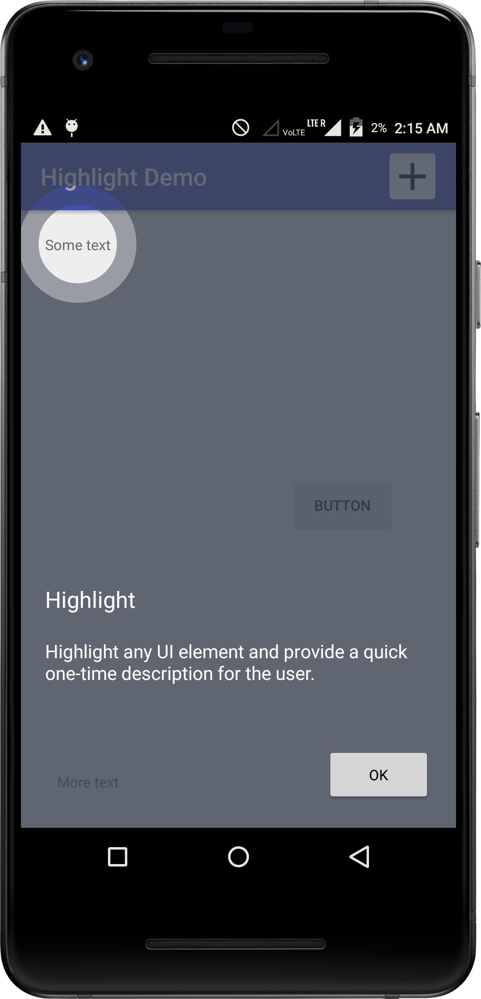
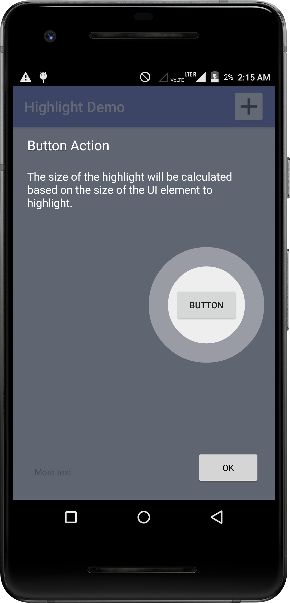
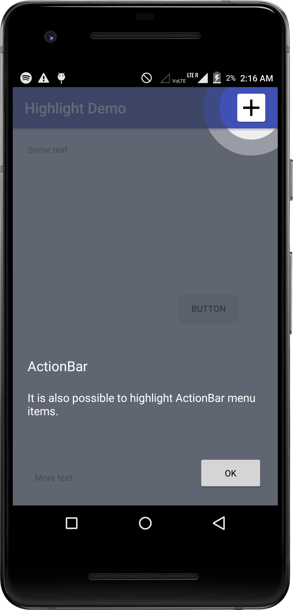

Highlight
====

Highlight is an Android library that highlights UI elements. It can be integrated into other
Android apps to showcase an app's usage. The following screenshots demonstrate the concept:

</img> </img>

</img> </img>

Integration
----

Copy the 'highlight' folder to your project. Make it known to Gradle by adding
the module to settings.gradle:

~~~
include ':app', ':highlight'
~~~

Then add a dependency in app/build.gradle so that Highlight will be compiled as part of
your application:

~~~
dependencies {
    // Other dependencies...
    implementation project(':highlight')
}
~~~

API
----

Here is an example on how to define a Highlight for an UI element:

~~~
HighlightManager highlightManager = new HighlightManager(this);
highlightManager.addView(R.id.some_widget).setTitle(R.string.title)
                .setDescriptionId(R.string.description);
~~~

Refer to the
[demo app](https://github.com/Dheeraj1998/Highlight/blob/master/demo/app/src/main/java/org/puder/highlight/demo/MainActivity.java)
to see a complete example.

Status
----

This is an early version. It works fine for basic usage but needs more ways to
customize the look-and-feel of the hightlight. Feel free to send a Pull Request!

Licensing
----

This library is distributed under the Apache 2.0 License.
